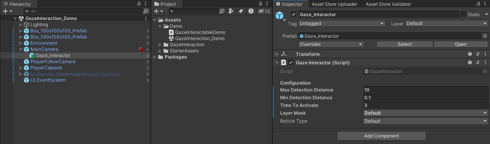

# Unity Gaze Interaction System (UGIS)

## Core Components

The system is built on two main components:

- [GazeInteractor](api/TS.GazeInteraction.GazeInteractor.html): Component attached to the Main Camera that sends out rays to detect GazeInteractables.
- [GazeInteractable](api/TS.GazeInteraction.GazeInteractable.html): Component attached to objects in the scene for the user to interact with.

When the Gaze Interactor detects a Gaze Interactable, it triggers interaction [events](https://tomazsaraiva.github.io/unity-gaze-interaction/api/TS.GazeInteraction.GazeInteractable.html#events).

## Setup

### How to setup the GazeInteractor

   1. In the Hierarchy window, create an empty GameObject as a child of your Main Camera.
   2. Add the [GazeInteractor](api/TS.GazeInteraction.GazeInteractor.html) component to this new GameObject.

### How to setup GazeInteractables

   1. Attach the [GazeInteractable](api/TS.GazeInteraction.GazeInteractable.html) component to any object in your scene that you want users to interact with via gaze.
   2. In the Inspector Window, use the interaction [events](https://tomazsaraiva.github.io/unity-gaze-interaction/api/TS.GazeInteraction.GazeInteractable.html#events) to specify what happens when the user looks at the object.

## Customization

The basic setup allows users to interact with objects simply by looking at them. Both the [GazeInteractor](api/TS.GazeInteraction.GazeInteractor.html) and [GazeInteractable](api/TS.GazeInteraction.GazeInteractable.html) Components have options you can use to customize their behavior.

### How to customize the GazeInteractor

- **Max Detection Distance:** This property defines the maximum distance from the camera at which the GazeInteractor can detect Gaze Interactable objects. Users looking at objects beyond this distance will not trigger interaction.
- **Min Detection Distance:** This property defines the minimum distance from the camera at which the GazeInteractor can detect Gaze Interactable objects. Users looking at objects closer than this distance will not trigger interaction.
- **Time To Activate:** This property sets the dwell time required for the Gaze Interaction System to register a successful activation. Users must look at a Gaze Interactable object for this duration (in seconds) before it triggers the [On Gaze Activated](https://tomazsaraiva.github.io/unity-gaze-interaction/api/TS.GazeInteraction.GazeInteractable.OnActivated.html) event.
- **Layer Mask:** This property defines a layer mask that restricts which objects in the scene the GazeInteractor's raycast can collide with. Only objects included in the selected layers will be considered Gaze Interactables.  
- **Reticle Type:** This property determines the type of reticle (visual feedback) displayed to indicate where the user is looking. The available options are defined by the [ReticleType](https://tomazsaraiva.github.io/unity-gaze-interaction/api/TS.GazeInteraction.ReticleType.html) enumeration within the code.

### How to customize the GazeInteractables

- **Is Activable:** This property determines whether the GazeInteractable object can be activated through gaze interaction. If set to false, users looking at the object will not trigger the [On Gaze Activated](https://tomazsaraiva.github.io/unity-gaze-interaction/api/TS.GazeInteraction.GazeInteractable.OnActivated.html) event.
- **Exit Delay:** This property defines a time delay (in seconds) before the [On Gaze Exit](https://tomazsaraiva.github.io/unity-gaze-interaction/api/TS.GazeInteraction.GazeInteractable.OnExit.html) event is triggered after the user's gaze moves away from the GazeInteractable object. This allows for a smoother user experience when transitioning focus between objects.
- **[On Gaze Enter](https://tomazsaraiva.github.io/unity-gaze-interaction/api/TS.GazeInteraction.GazeInteractable.OnEnter.html):** This UnityEvent is triggered when the user's gaze initially focuses on a GazeInteractable object. You can use this event to perform actions like highlighting the object or playing a sound effect.
- **[On Gaze Stay](https://tomazsaraiva.github.io/unity-gaze-interaction/api/TS.GazeInteraction.GazeInteractable.OnStay.html):** This UnityEvent is triggered repeatedly while the user's gaze remains focused on a GazeInteractable object. This is typically used for actions that require sustained focus, such as charging up an attack.
- **[On Gaze Exit](https://tomazsaraiva.github.io/unity-gaze-interaction/api/TS.GazeInteraction.GazeInteractable.OnExit.html):** This UnityEvent is triggered after the user's gaze moves away from a GazeInteractable object, following the delay defined by _exitDelay. You can use this event to reset the object's state or perform cleanup actions.
- **[On Gaze Activated](https://tomazsaraiva.github.io/unity-gaze-interaction/api/TS.GazeInteraction.GazeInteractable.OnActivated.html):** This UnityEvent is triggered when the user's gaze remains focused on a GazeInteractable object for the duration specified by `Time To Activate` (dwell time) and the object is set to be activable (`Is Activable` is true). This is the core interaction event for the system.

## Helpful links

- For a more in-depth explanation, check out this [video](https://www.youtube.com/watch?v=8p4erfeWatA&list=PLBBRLwJVhEhNeLRaBjJh7O8cvGHFKOpGW&index=1).
- Explore the [API Reference](https://tomazsaraiva.github.io/unity-gaze-interaction/api/TS.GazeInteraction.html) for more details.
- Modify the source code available on [GitHub](https://github.com/tomazsaraiva/unity-gaze-interaction).
- Install directly from the [Unity Asset Store](https://assetstore.unity.com/packages/tools/camera/vr-gaze-interaction-system-241337).
- Get in touch with me at [tomazsaraiva.com](https://tomazsaraiva.com).
