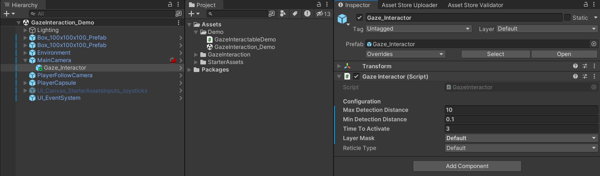
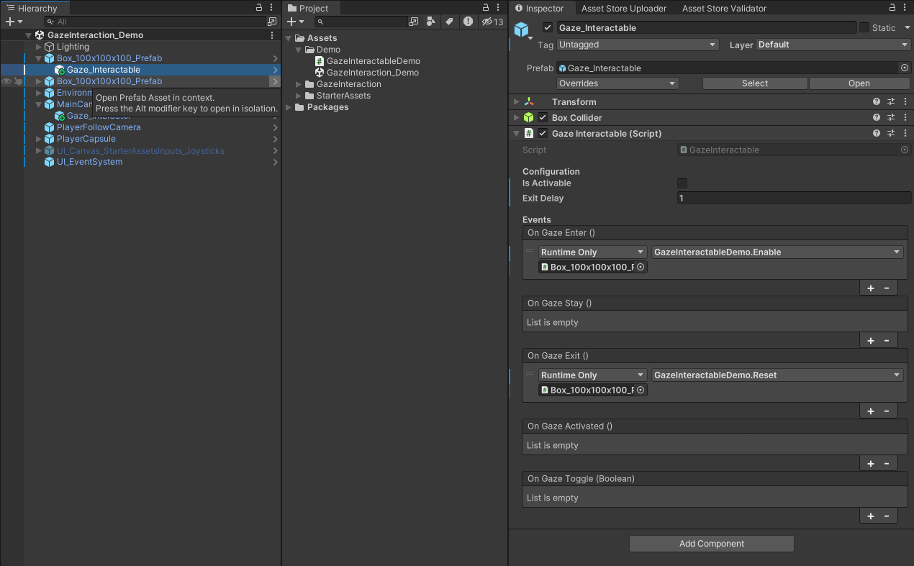

# Gaze Interaction System

The Gaze Interaction system is based on the same approach used in the [Unity XR Interaction Toolkit](https://docs.unity3d.com/Packages/com.unity.xr.interaction.toolkit@2.0/manual/index.html).

## Core Components

The system is built on two main components:

- [GazeInteractor](api/TS.GazeInteraction.GazeInteractor.html): Component attached to the Main Camera that sends out rays to detect GazeInteractables.
- [GazeInteractable](api/TS.GazeInteraction.GazeInteractable.html): Component attached to objects in the scene for the user to interact with. When the Gaze Interactor detects a Gaze Interactable, it triggers interaction events.

## Setting Up the System

### Where to download

- [Unity Asset Store](https://assetstore.unity.com/packages/tools/camera/vr-gaze-interaction-system-241337)
- [GitHub](https://github.com/tomazsaraiva/unity-gaze-interaction/)

### How to setup the GazeInteractor

   1. In the Hierarchy window, create a new empty GameObject as a child of your main camera.
   2. Add the GazeInteractor script to this new GameObject. You can find this script in the inspector window by searching for "GazeInteractor".

### How to setup GazeInteractables

   1. Attach the GazeInteractable script to any object in your scene that you want the user to be able to interact with by looking at it.
   2. In the inspector window, you can define what happens when the user looks at the object for a certain amount of time (dwell time) or clicks on it (optional).

This basic setup allows users to interact with objects simply by looking at them.

## Customization

Both the GazeInteractor and GazeInteractable scripts have many options you can use to customize their behavior.

### How to customize the GazeInteractor

- **_maxDetectionDistance:** This property defines the maximum distance from the camera at which the GazeInteractor can detect Gaze Interactable objects. Users looking at objects beyond this distance will not trigger interaction.
- **_minDetectionDistance:** This property defines the minimum distance from the camera at which the GazeInteractor can detect Gaze Interactable objects. Users looking at objects closer than this distance will not trigger interaction.
- **_timeToActivate:** This property sets the dwell time required for the Gaze Interaction System to register a successful activation. Users must look at a Gaze Interactable object for this duration (in seconds) before it triggers the activation event.
- **_layerMask:** This property defines a layer mask that restricts which objects in the scene the GazeInteractor's raycast can collide with. Only objects included in the selected layers will be considered Gaze Interactables.  
- **_reticleType:** This property determines the type of reticle (visual feedback) displayed to indicate where the user is looking. The available options are defined by the `ReticleType` enumeration within the code.

### How to customize the GazeInteractables

- **_isActivable:** This property determines whether the GazeInteractable object can be activated through gaze interaction. If set to false, users looking at the object will not trigger the OnGazeActivated event.
- **_exitDelay:** This property defines a time delay (in seconds) before the OnGazeExit event is triggered after the user's gaze moves away from the GazeInteractable object. This allows for a smoother user experience when transitioning focus between objects.
- **OnGazeEnter:** This UnityEvent is triggered when the user's gaze initially focuses on a GazeInteractable object. You can use this event to perform actions like highlighting the object or playing a sound effect.
- **OnGazeStay:** This UnityEvent is triggered repeatedly while the user's gaze remains focused on a GazeInteractable object. This is typically used for actions that require sustained focus, such as charging up an attack.
- **OnGazeExit:** This UnityEvent is triggered after the user's gaze moves away from a GazeInteractable object, following the delay defined by _exitDelay. You can use this event to reset the object's state or perform cleanup actions.
- **OnGazeActivated:** This UnityEvent is triggered when the user's gaze remains focused on a GazeInteractable object for the duration specified by _timeToActivate (dwell time) and the object is set to be activable (_isActivable is true). This is the core interaction event for the system.
- **OnGazeToggle:** This UnityEvent is triggered whenever the state of gaze interaction with the object toggles (e.g., from gaze enter to gaze exit or vice versa). It provides a boolean argument indicating the current gaze state (true for gaze enter/stay, false for gaze exit). You can use this event for more complex interaction logic.

For a more in-depth explanation, check out this [video](https://www.youtube.com/watch?v=8p4erfeWatA&list=PLBBRLwJVhEhNeLRaBjJh7O8cvGHFKOpGW&index=1).

All feedback and contributions are more than welcome.